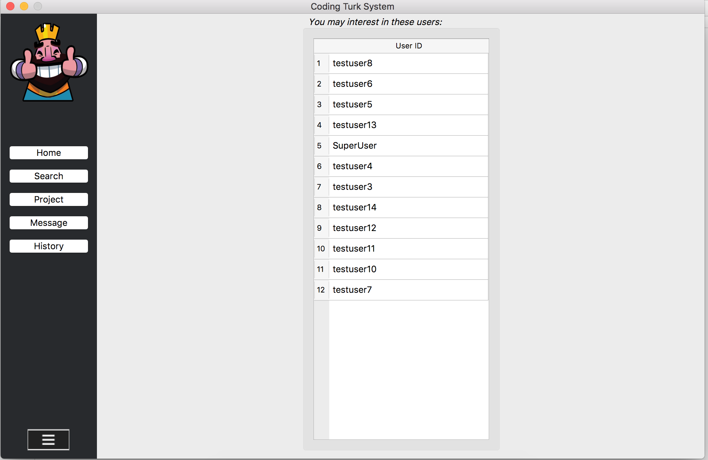
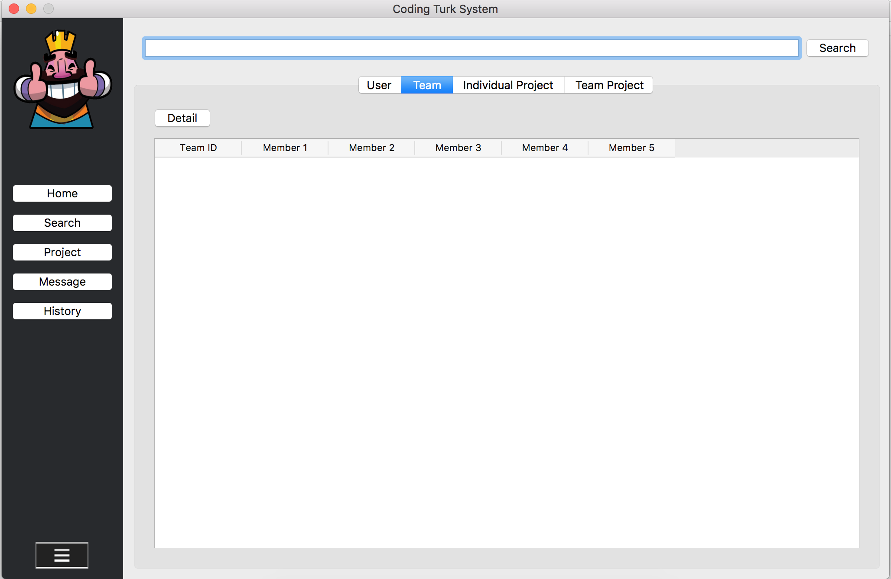
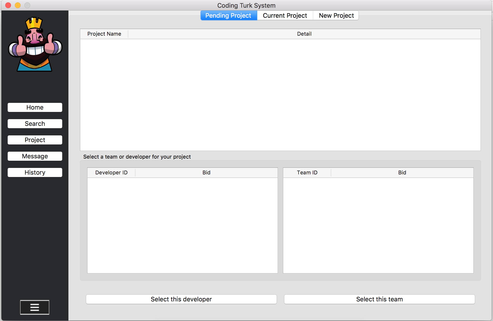
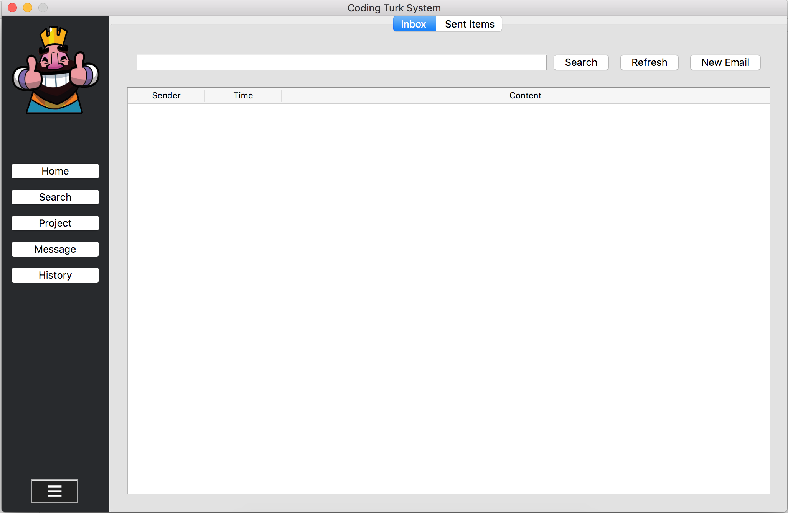
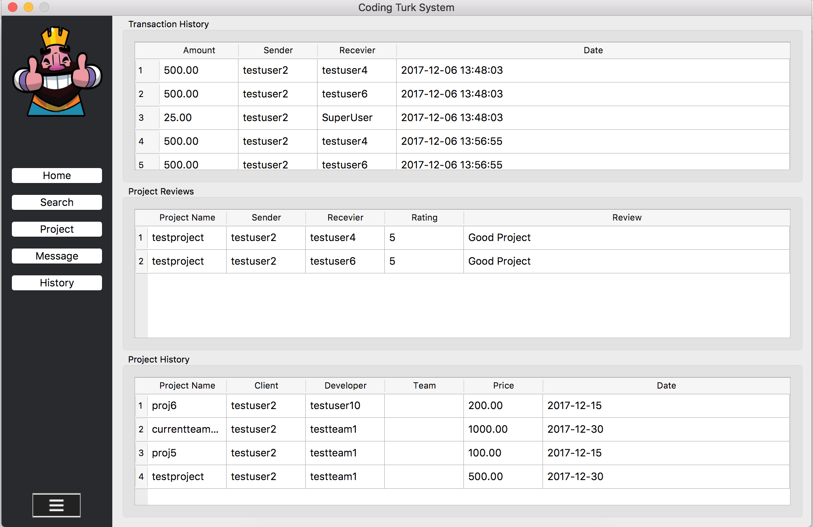
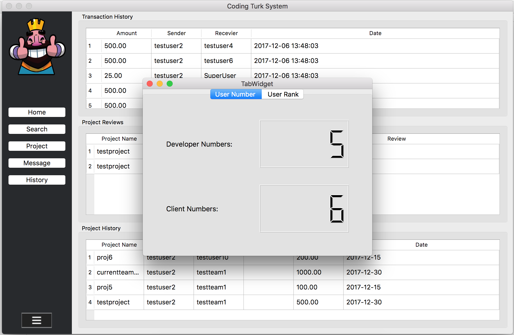

# cts

A desktop code trading application demo, group project for CCNY CSC322 software engineering.

## How to run

1. Clone this repo

		git clone https://github.com/whuang001/cts.git

2. Install the requirements

		pip3 install -r requirements.txt

3. You need to install `MYSQL` or `MariaDB` in your computer

4. Create a new database in SQL console, name it `cts`

5. Manually restore the cts database by doing follow (backup12-7-2.sql is located in `cts/db/`):

		mysql -u root cts < backup12-7-2.sql

6. Install the requirements

		pip3 install -r requirements.txt

7. Run `cts/src/core.py` using python3

		python3 core.py

## Demo

1. Login/Signup Page:

2. Home Page:

3. Search Page:

4. Project Page:

5. Build in mail system:

6. History Page:

7. System Statistic:

